# 📘 Manual de Evidencias y Funcionamiento Visual
**Sistema de Trading Algorítmico de Opciones Financieras bajo Arquitectura Resiliente y Distribuida**

* **Autor:** Carlos Novo
* **Titulacion:** Grado en Ingeniería Telemática
* **Universidad:** Universidad de Alcalá (UAH)

---

## 1. Introducción
El presente manual tiene por objeto proporcionar una demostración empírica y visual del funcionamiento integral de la plataforma de trading algorítmico implementada para este Trabajo de Fin de Grado. Dado que el sistema integra múltiples capas lógicas distribuidas (Frontend en Streamlit, Backend de APIs en FastAPI, persistencia local con SQLite, contenedores Docker y conexiones de red en sockets TCP con Interactive Brokers), este documento sirve como bitácora de evidencias técnicas. 

A través de las secciones siguientes se expone la navegación y el comportamiento dinámico del sistema frente a eventos de mercado, fallos simulados de red y accesos concurrentes, permitiendo al tribunal evaluar la robustez del desarrollo sin necesidad de configurar el entorno de ejecución ni el simulador financiero.

---

## 2. Paso 1: Control de Acceso y Seguridad (Capa de Presentación)
Para garantizar la confidencialidad y restringir la operativa de mercado únicamente a personal autorizado, la interfaz de usuario implementa una capa protectora de seguridad a nivel de sesión. 

El formulario de inicio de sesión no almacena las credenciales en texto plano; por el contrario, utiliza un algoritmo criptográfico de hash de un solo sentido **SHA-256**. Al introducir la clave, el sistema calcula el resumen criptográfico en memoria y lo compara con el valor hexadecimal persistido en la configuración segura. Hasta que el token de sesión no es marcado como autorizado, la interfaz bloquea cualquier renderizado de componentes y detiene de forma preventiva la ejecución del código Streamlit.

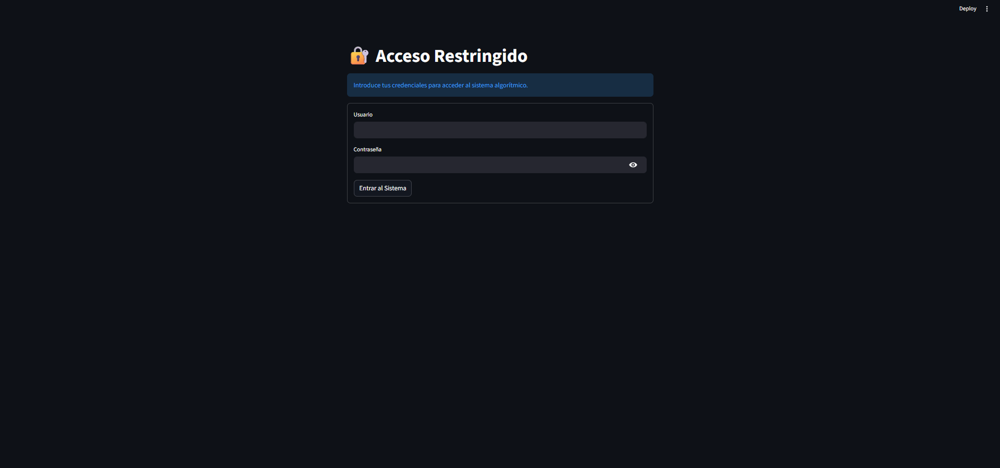

---

## 3. Paso 2: Consola de Control e Integración con IBKR
Una vez superada la autenticación, la aplicación establece una micro-sesión asíncrona mediante sockets TCP con la interfaz API de Interactive Brokers (generalmente a través del puerto `4002` del Gateway o de TWS). 

El sistema ejecuta consultas eficientes no bloqueantes en segundo plano utilizando el event loop de Python (`asyncio`) para recuperar:
1. El balance neto de la cuenta (Cash Balance).
2. Las posiciones de cartera abiertas actualmente (Portfolio snapshot).

Esto evita la congelación del hilo principal del renderizado visual y garantiza que la consola de control responda con tiempos de latencia mínimos.

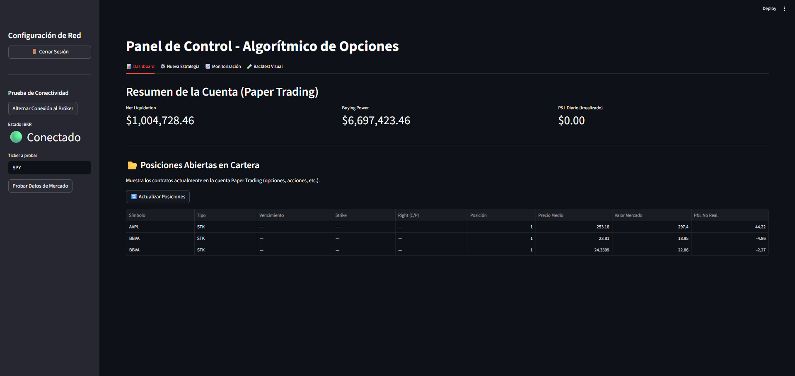

---

## 4. Paso 3: Motor Financiero Cuantitativo (Black-Scholes)

### A. Configuración del Combo Iron Condor
El núcleo cuantitativo del sistema requiere de parámetros específicos aportados por el operador para definir el rango operativo de la estrategia multi-pata (Iron Condor). En esta interfaz se especifican las distancias de los strikes y los parámetros teóricos para el análisis de valoración temporal de opciones.

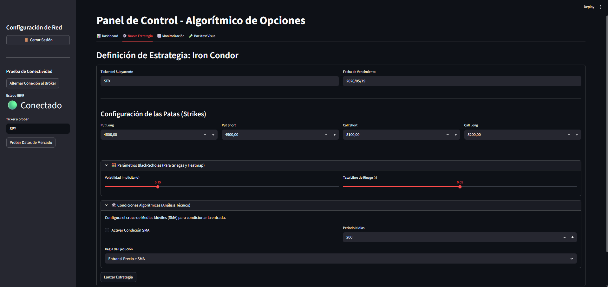

### B. Análisis Visual de Rentabilidad Teórica (Payoff 2D)
A partir de los 4 strikes seleccionados (Put Long, Put Short, Call Short, Call Long) y la prima neta obtenida (crédito real), la aplicación computa la rentabilidad a vencimiento de la estrategia. 

El motor calcula la suma algebraica de los pagos individuales de cada contrato y genera la curva P&L en una escala continua de precios del subyacente. Los puntos de equilibrio matemático (Break-Even Points) se obtienen mediante:
* $BEP_{Inferior} = Strike_{PutShort} - Cr\acute{e}dito$
* $BEP_{Superior} = Strike_{CallShort} + Cr\acute{e}dito$

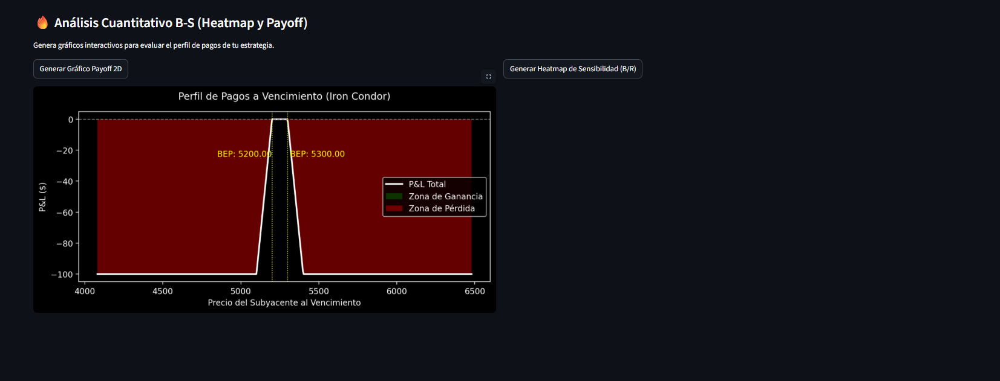

### C. Análisis de Sensibilidad (Heatmap B-S)
Reutilizando el modelo de pricing teórico de Black-Scholes a partir de la volatilidad implícita ($\sigma$) y el tipo de interés libre de riesgo ($r$), el sistema computa el ratio beneficio/riesgo (B/R) dinámico. 

Mediante una malla de desplazamientos, calcula el impacto financiero si los strikes del lado Put o del lado Call sufrieran alteraciones o desviaciones respecto al precio spot del subyacente, proporcionando una visualización densa de la sensibilidad al riesgo.

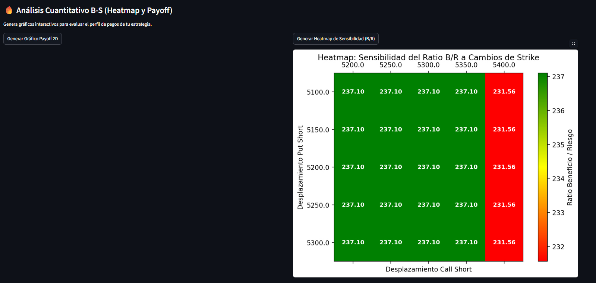

---

## 5. Paso 4: Motor Algorítmico de Entrada (SMA Filter)
Como mecanismo de control de riesgo cuantitativo, el sistema no ejecuta ninguna transacción si el análisis técnico de tendencia es desfavorable. 

Al marcar la condición de Media Móvil Simple (SMA), el software descarga el histórico de precios de los últimos $N$ días del activo subyacente y evalúa si la cotización actual valida la regla algorítmica seleccionada (por ejemplo, exigir que el precio esté por encima de la SMA para validar entradas alcistas). En caso de no cumplir la condición, el motor detiene la transmisión y bloquea la generación de la orden para evitar pérdidas.

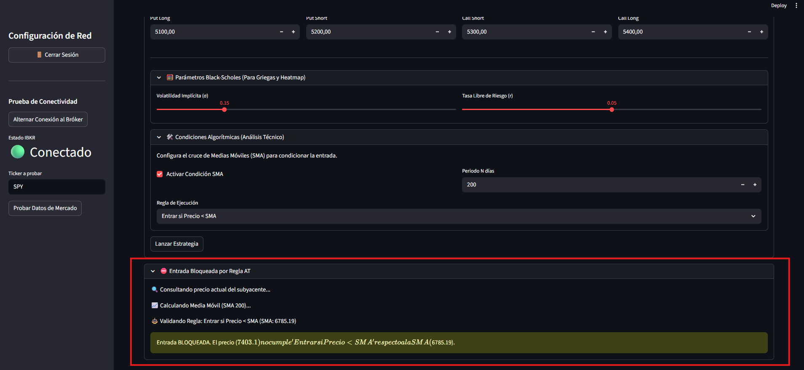

El bloqueo preventivo del motor lógico se propaga de forma inmediata a los canales de monitorización externos, informando detalladamente sobre la restricción aplicada a la estrategia.

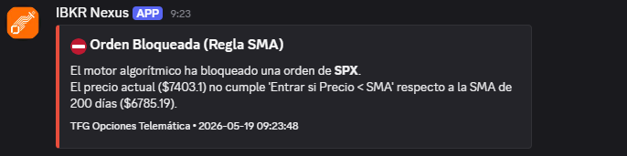

---

## 6. Paso 5: Telemetría y Alertas en Tiempo Real
Cuando la validación técnica y cuantitativa resulta favorable, los detalles completos del combo multi-pata se empaquetan en una orden tipo BAG para mitigar el riesgo de ejecución pata a pata (ejecución atómica). 

En el instante exacto del envío, un módulo asíncrono realiza una petición POST HTTP hacia el servidor telemático externo (Discord Webhook). La carga útil (Payload) en formato JSON detalla de manera estructurada los strikes elegidos, el crédito de mercado obtenido y el identificador de orden generado para garantizar el control a distancia.

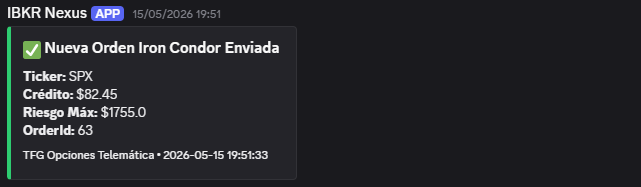

---

## 7. Paso 6: Tolerancia a Fallos de Red y Resiliencia (Watchdog)

### A. Detección y Encolamiento local
Ante una caída en la conexión de red o una parada inesperada del Gateway del bróker, el sistema activa su mecanismo de tolerancia a fallos. 

En el instante del envío, si la conexión falla, el gestor intercepta el error, notifica la alerta amarilla y persiste automáticamente los parámetros de la orden en la tabla SQLite de reintentos (`cola_reintentos`).

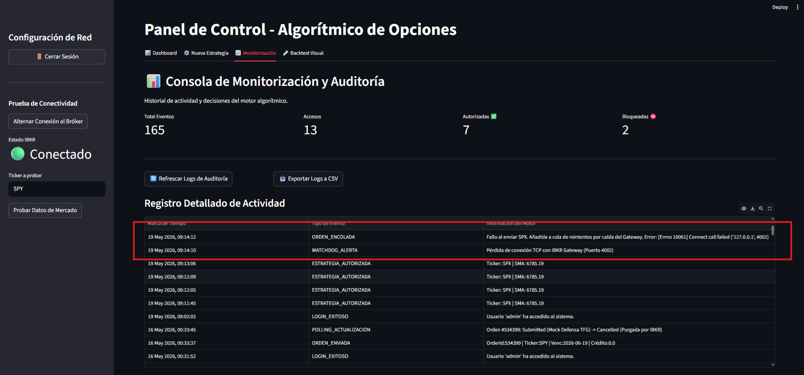

### B. Heartbeat y Autocuración (Watchdog Worker)
Un hilo de ejecución en segundo plano supervisa permanentemente la salud del canal de comunicación (Heartbeat). 

Al detectar que la conexión de red o el socket del bróker vuelve a estar activo, el Watchdog recupera de forma secuencial las órdenes de la cola en la base de datos local SQLite, restablece la comunicación con la API de Interactive Brokers y reenvía las transacciones pendientes. El webhook de Discord avisa inmediatamente de la recuperación automática.

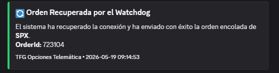

---

## 8. Paso 7: Auditoría Permanente y Trazabilidad
Para cumplir con los estándares de auditoría de los sistemas telemáticos transaccionales, cada evento relevante (logins exitosos, accesos bloqueados, bloqueos por reglas técnicas de SMA, envíos de órdenes y cancelaciones) es registrado de manera persistente con marcas de tiempo en formato UNIX. 

El panel de monitorización permite al administrador consultar estos históricos e interactuar directamente con ellos (ej. descargar los reportes consolidados en formato CSV para su análisis externo o solicitar cancelaciones activas de órdenes pendientes).

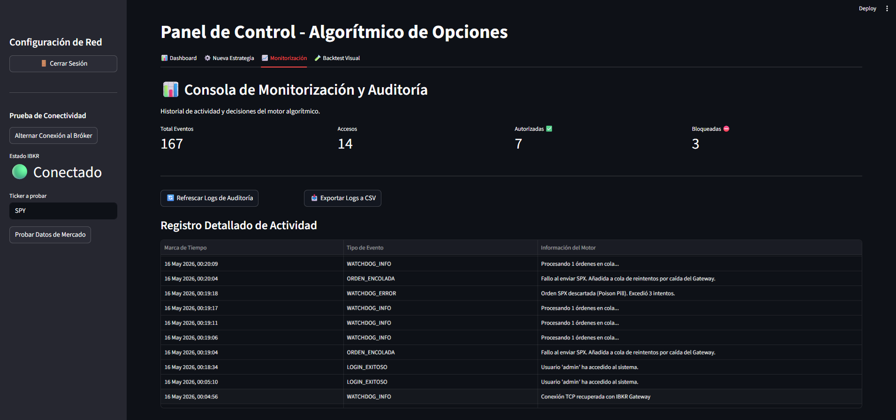
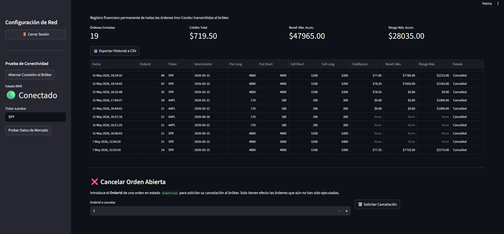

---

## 9. Paso 8: Capa de Interoperabilidad (API REST Cibersegura)
El sistema desacopla el frontend del backend mediante un microservicio construido con **FastAPI**. Sin embargo, la exposición pública de datos de auditoría de mercado representa un riesgo de seguridad elevado. 

Por ello, se implementó un flujo estándar **OAuth2** con tokens **JWT** firmados criptográficamente. Al acceder a la interfaz de documentación interactiva Swagger UI, todos los recursos y operaciones REST (`/operaciones`, `/auditoria`, `/cola-reintentos`) muestran un icono de candado que bloquea la respuesta HTTP con un código `401 Unauthorized` a menos que el cliente se autentique proporcionando un token válido expedido por el endpoint `/token`.

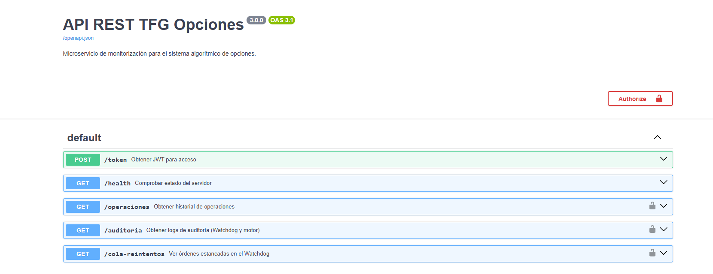

---

## 10. Paso 9: Aseguramiento de Calidad (QA) y Despliegue (DevOps)

### A. Pruebas Unitarias (`pytest`)
Con el objetivo de certificar el rigor científico del software y la precisión matemática del cálculo de derivadas financieras y regresiones del motor algorítmico, el repositorio incluye una suite automatizada de pruebas unitarias basadas en `pytest`. 

Estas pruebas simulan las llamadas de red usando patrones Mock, permitiendo certificar la fiabilidad de las fórmulas de Black-Scholes de forma independiente.

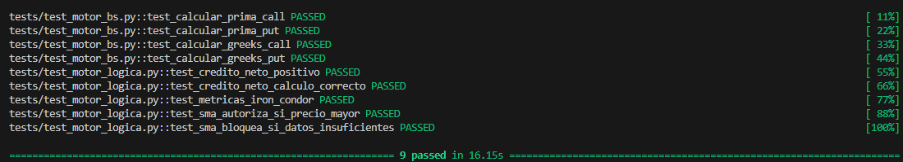

### B. Arquitectura Dockerizada (Docker Compose)
Finalmente, para asegurar la portabilidad y la reproducibilidad técnica en cualquier infraestructura en la nube, el ecosistema completo se ha empaquetado en contenedores de software aislados. 

Mediante el orquestador **Docker Compose**, se levantan e intercomunican simultáneamente el contenedor del Frontend (Streamlit en puerto 8501) y el del microservicio Backend (FastAPI en puerto 8000), garantizando que todo el entorno se ejecute con un único comando.

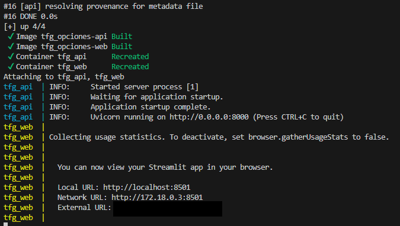
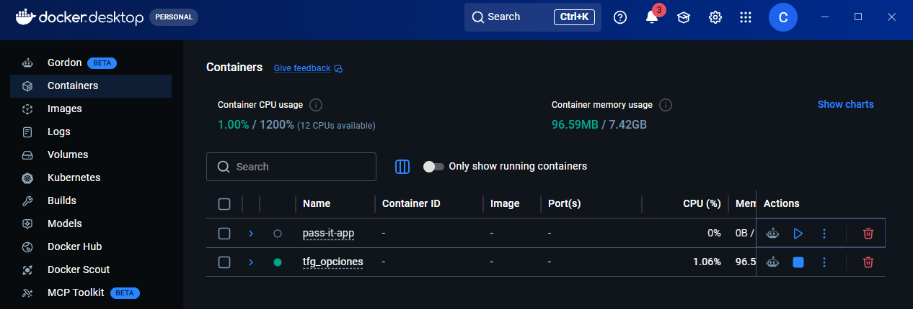
